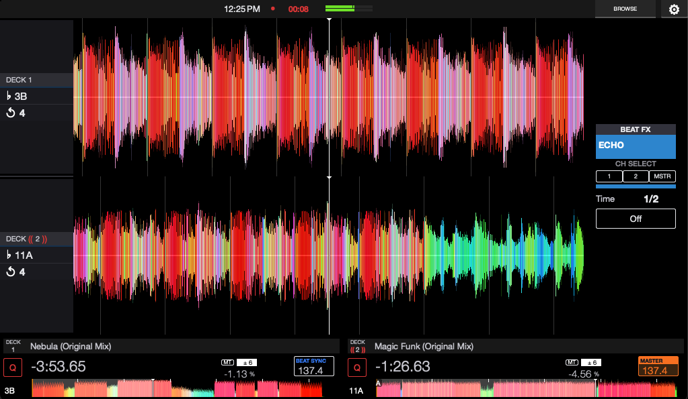
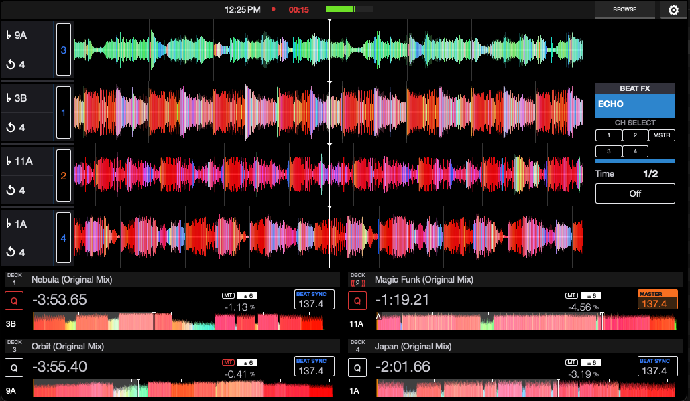
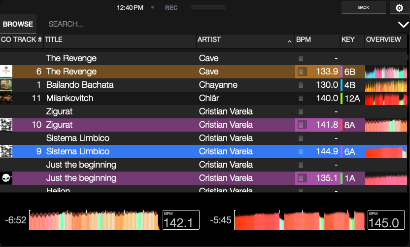
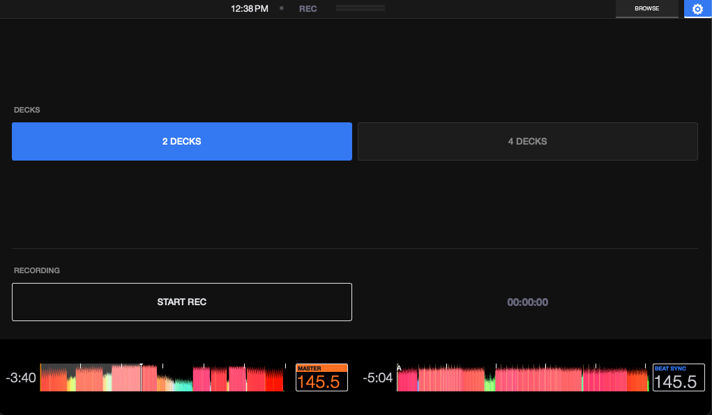

# XDJ OPEN SOURCE — Mixxx Skin

A Pioneer/AlphaTheta XDJ-RX3 / XDJ-AZ inspired skin for [Mixxx](https://mixxx.org/) 2.5+, designed for use with Pioneer / AlphaTheta DJ controllers (DDJ-400, DDJ-SB3, DDJ-FLX4, DDJ-FLX10 and similar).

## Screenshots

### Startup


### 2 Decks


### 4 Decks


### Library


### Settings



---

## Features

### Layout
- **2-deck and 4-deck modes** — toggle between 2 and 4 visible decks at any time from the Settings page. The Mixxx engine always runs with 4 decks available; the UI simply shows or hides decks 3 and 4.
- **4-deck order: 3 → 1 → 2 → 4** — in 4-deck mode the decks are arranged top-to-bottom as 3, 1, 2, 4 to match a natural hardware pairing workflow.
- **Left sidebar** — per-deck info panel showing:
  - Deck number (2-deck mode: header at top; 4-deck mode: compact numbered badge on the right column)
  - Current key (♭ notation)
  - Active loop size (turns orange when loop is engaged)
- **Waveform display** — large scrolling waveform with hotcue markers (A–H), loop markers and range overlay, and cue point indicator. Three color modes available via Mixxx Preferences (3-Band, RGB, Single color).
- **Mini deck strip** — compact deck overview (time, waveform scrubber, BPM) at the bottom of the Library and Settings pages, consistent with the main view.

### Top bar
- System clock
- Recording status indicator (circle turns red + duration counter when recording)
- Master output L/R VU meter (green → orange → red)
- **BROWSE / BACK** navigation button (switches between Library and main Overview)
- **⚙ Settings** "Shortcut" button

### Per-deck info (bottom row)
- Track title
- Time display (click to toggle elapsed / remaining)
- Quantize (Q) button
- Pitch % and range (±)
- MT (Master Tempo / Keylock) indicator
- BPM display — turns orange and shows **MASTER** when this deck is the sync leader; shows **BEAT SYNC** when following another deck
- Key display
- Waveform overview scrubber with hotcue and loop markers

### Beat FX panel (right sidebar)
- Effect selector (dropdown)
- Effect level meter
- CH SELECT — assign the effect to channels 1, 2, 3, 4 or MASTER (in 4-deck mode, a second row of channel buttons appears automatically)
- Beat division control
- Effect on/off toggle

### Settings page (⚙)
- **DECKS** — switch between 2-deck and 4-deck layout
- **RECORDING** — start / stop recording + elapsed time counter

---

## Installation

1. Download or clone this repository.
2. Copy the `XDJ OPEN SOURCE` folder into your Mixxx skins directory:

| Platform | Path |
|---|---|
| macOS | `~/Library/Containers/org.mixxx.mixxx/Data/Library/Application Support/Mixxx/skins/` |
| Windows | `%LOCALAPPDATA%\Mixxx\skins\` |
| Linux | `~/.mixxx/skins/` |

3. Open Mixxx → **Preferences → Interface** → select **XDJ OPEN SOURCE** as the skin.
4. Apply.

> **Note:** This skin always configures Mixxx with 4 engine decks (`[Master],num_decks = 4`). You may need to configure 4 deck outputs in **Preferences → Sound Hardware** even if you only use 2 decks visually.

---

## MIDI Mapping — Topbar Buttons

The **BROWSE/BACK** and **⚙ (Settings)** buttons in the top bar are skin-side UI elements bound to Mixxx's internal tab-switching controls. To trigger them from a physical button on your controller you need to map the corresponding ControlObjects in your controller's MIDI mapping.

### ControlObjects to map

| Button | ControlObject | Behavior |
|---|---|---|
| BROWSE | `[Tab],library` | Switches to the Library page |
| BACK | `[Tab],overview` | Switches back to the main Overview page |
| ⚙ SHORTCUT | `[Tab],shortcut` | Opens the Settings page |

> Mixxx's `WidgetStack` automatically resets the other tabs to `0` when one is activated, so you can map each button as a simple momentary toggle (send value `1` on press) — no need to track state in your script.

---

### Method 1 — MIDI Learning (simplest)

1. Open **Preferences → Controllers**, select your controller, click **Edit**.
2. Click **Learn** in the mapping editor.
3. Click the **BROWSE** button in the Mixxx skin.
4. Press the physical button on your controller you want to assign.
5. Repeat for **BACK** and **⚙**.
6. Save the mapping.

> Not all controllers support MIDI learning for every button. If a button is not detected, use Method 2.

---

### Method 2 — XML Mapping file (DDJ-400, DDJ-SB3, DDJ-FLX4, DDJ-FLX-10, etc.)

Most Pioneer/AT controllers use an `.xml` mapping file located in:

| Platform | Path |
|---|---|
| macOS | `~/Library/Containers/org.mixxx.mixxx/Data/Library/Application Support/Mixxx/controllers/` |
| Windows | `%LOCALAPPDATA%\Mixxx\controllers\` |
| Linux | `~/.mixxx/controllers/` |

Open the `.xml` file for your controller (e.g. `Pioneer-DDJ-400.midi.xml`) and add entries inside the `<controls>` block:

```xml
<!-- BROWSE button → switch to Library -->
<control>
  <group>[Tab]</group>
  <key>library</key>
  <status>0x9N</status>   <!-- replace N with MIDI channel 0-F, e.g. 0x90 -->
  <midino>0xXX</midino>   <!-- replace with the MIDI note number of your button -->
  <options>
    <normal/>
  </options>
</control>

<!-- BACK button → switch to Overview -->
<control>
  <group>[Tab]</group>
  <key>overview</key>
  <status>0x9N</status>
  <midino>0xXX</midino>
  <options>
    <normal/>
  </options>
</control>

<!-- Settings button → switch to Settings page -->
<control>
  <group>[Tab]</group>
  <key>shortcut</key>
  <status>0x9N</status>
  <midino>0xXX</midino>
  <options>
    <normal/>
  </options>
</control>
```

To find the correct `status` and `midino` values for a specific button on your controller:

1. Enable **Preferences → Controllers → [your controller] → Enable** and check **Log to file**.
2. Press the button — the MIDI message will appear in the Mixxx log (`mixxx.log`) as something like `[Controller] MIDI message: status=0x90 note=0x1C value=0x7F`.
3. Use those values in the XML above.

---

### Method 3 — JavaScript mapping

If your controller uses a `.js` script file, add calls inside the appropriate button handler:

```javascript
// BROWSE button pressed
engine.setValue('[Tab]', 'library', 1);

// BACK button pressed
engine.setValue('[Tab]', 'overview', 1);

// Settings button pressed
engine.setValue('[Tab]', 'shortcut', 1);
```


---

*Skin designed for Mixxx 2.5+ · Inspired by the Pioneer XDJ-RX3 / XDJ-AZ interface*
